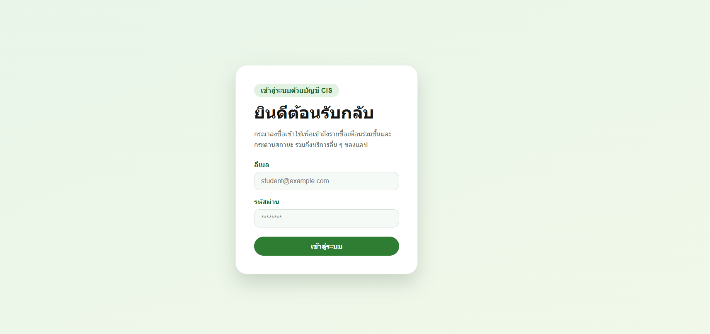
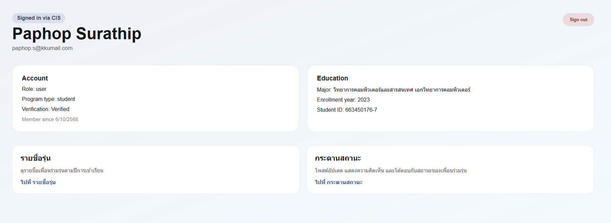
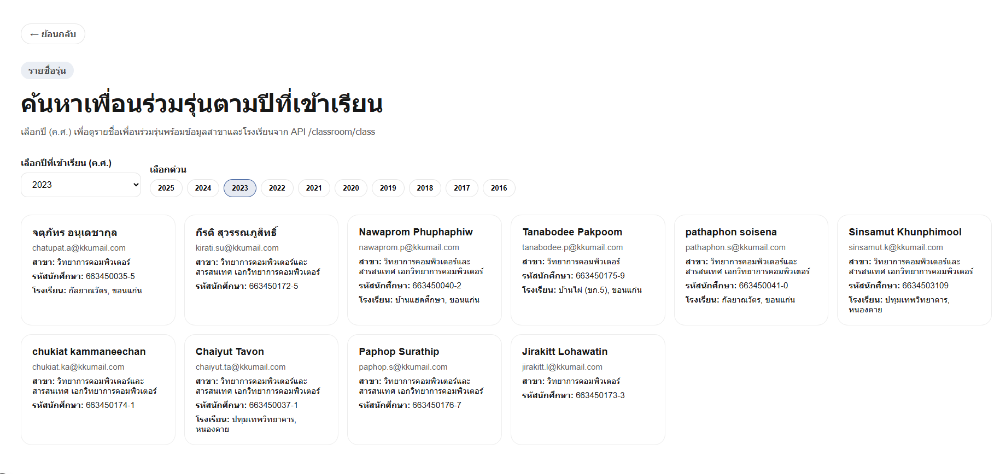
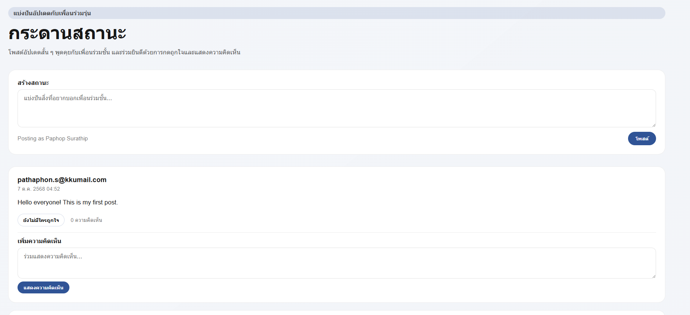

# CIS Classroom Companion

แอป Next.js สำหรับใช้งาน CIS Classroom API อย่างง่าย ประกอบด้วยฟีเจอร์หลักต่อไปนี้

- เข้าสู่ระบบและดูข้อมูลโปรไฟล์
- กระดานสถานะเพื่อโพสต์ พูดคุย และกดถูกใจ
- รายชื่อเพื่อนร่วมรุ่น พร้อมตัวกรองตามปีที่เข้าเรียน

## ภาพหน้าจอ

| หน้าเข้าสู่ระบบ | หน้าแดชบอร์ด | รายชื่อเพื่อนร่วมรุ่น |
| --- | --- | --- |
|  |  |  |

| กระดานสถานะ |
| --- |
|  |

## วิธีเริ่มต้นใช้งาน

1. ติดตั้งแพ็กเกจที่จำเป็น

   ```bash
   npm install
   ```

2. เริ่มรันเซิร์ฟเวอร์สำหรับพัฒนา

   ```bash
   npm run dev
   ```

   จากนั้นเปิดเบราว์เซอร์ไปที่ `http://localhost:3000`

ภายในโปรเจ็กต์มีการฝังค่า `CIS_API_KEY` สำหรับใช้ทดสอบในเครื่องไว้แล้ว หากต้องการใช้คีย์ของตนเอง สามารถสร้างไฟล์ `.env.local` แล้วระบุค่า `CIS_API_KEY` เพื่อให้ระบบใช้คีย์นั้นแทนได้
